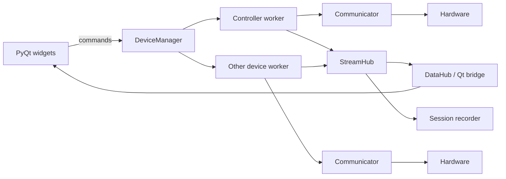

# Pneumatic Control & Instrumentation Dashboard

PyQt5 control/monitoring application for the pneumatic/solenoid test system, plus firmware and reference drivers for the surrounding laboratory instrumentation.

> **Audit status — 2026-10-07:** the core dashboard architecture is current and usable. The Arduino relay controller is integrated. The GRAPHIX and analog pressure-acquisition code exists as a tested reference package under `other/vacuum_instrumentation_bundle_v2`, but has **not yet been wired into the main app**. LAUDA RP 290 E and Agilent 7890A integration is documented/planned but does not yet have drivers in `src/`.

## Repository map

```text
.
├── config/                         Runtime device, actuator, sensor and dashboard YAML
├── docs/                           Architecture, project status and hardware-document index
│   └── hardware/                   Manufacturer-manual index + download helper
├── firmware/
│   ├── relay_controls/             Arduino Due relay-controller firmware
│   └── thermocouple_reader/        MCP9601 thermocouple example firmware
├── src/pneumatic_valve_panel/      Main PyQt application package
│   └── drivers/                    Instrument drivers, selected by name in devices.yaml
├── tests/                          pytest suite (includes a Python model of the relay firmware)
├── tools/                          Bench utilities (e.g. relay_bench.py)
├── other/
│   └── vacuum_instrumentation_bundle_v2/
│       ├── firmware/               RP2040 Adalogger DAQ examples
│       ├── python/                 GRAPHIX + analog DAQ reference drivers
│       └── docs/                   Vacuum instrumentation notes
├── examples/                       Example dashboard configurations
├── recorded_sessions/              Runtime logs/data (gitignored)
├── run_app.py                      Main launcher
└── *.md                            Feature-specific design guides
```

More detailed maps are in [`docs/SYSTEM_ARCHITECTURE.md`](docs/SYSTEM_ARCHITECTURE.md) and [`src/pneumatic_valve_panel/README.md`](src/pneumatic_valve_panel/README.md).

## Quick start

Python 3.10+ is required.

```bash
python -m venv .venv
# Windows:
.venv\Scripts\activate
# macOS/Linux:
# source .venv/bin/activate

pip install -r requirements.txt
python run_app.py --demo     # try it with simulated hardware
python run_app.py            # real hardware from config/devices.yaml
```

Before connecting real hardware:

1. Flash `firmware/relay_controls/relay_controls.ino` (protocol v2). The app refuses to drive a controller that does not identify itself.
2. Set the controller's COM port in `config/devices.yaml` (currently `COM14`; it differs between computers).

If a device is missing or on the wrong port, the dashboard still opens, shows the reason in the Device Connectivity tile, and keeps retrying.

To add an instrument, see [`docs/ADDING_A_DEVICE.md`](docs/ADDING_A_DEVICE.md).

For development/tests:

```bash
pip install -e ".[dev]"
pytest -q
```

## Current runtime architecture

The desktop app does **not** let widgets directly own serial ports. Each enabled hardware device gets a `DeviceWorker` running in its own Qt thread. Workers publish normalized data to a shared `StreamHub`; `DataHub` provides the GUI-facing cache/signals. Commands are routed back through each device worker.



Communicators are built from the `driver:` names in `config/devices.yaml` (`src/pneumatic_valve_panel/drivers/`). That is the extension point for GRAPHIX, LAUDA and the Adalogger DAQ when they are promoted from reference code.

The valve panel shows what the relay controller reports it is **driving**, corrected once a second from the controller's status report. There is no valve-position feedback.

## Dashboard configuration note

The logical grid in `config/dashboard.yaml` currently has four rows because saved floating/closed-panel state has persisted a tile in row 3. Empty/floating-only rows collapse visually, so the visible dashboard can still behave like the documented three-row layout. Treat `dashboard.yaml` as **saved user state**, not a pristine default-layout example.

## Hardware currently represented in this project

- Arduino Due main pneumatic/solenoid controller.
- 5 V relay modules driving 24 V loads.
- SMC/Orange Coast pneumatic valve manifold.
- MCP9601 K-type thermocouple interface example.
- Leybold GRAPHIX vacuum gauge controller — RS-232 reference driver.
- Granville-Phillips/MKS Series 475 Convectron controller — analog-output acquisition.
- MKS PDR-D-1 + Baratron — analog-output acquisition.
- Adafruit Feather RP2040 Adalogger — low-cost analog DAQ reference firmware.
- LAUDA RP 290 E — Ethernet integration planned/documented.
- Agilent 7890A GC — Ethernet through Agilent software; APG Remote synchronization planned.
- Mean Well 24 V / 12 V / 5 V power architecture and DIN distribution hardware in the BOM/reference notes.

See [`docs/PROJECT_STATUS.md`](docs/PROJECT_STATUS.md) for the exact integrated/reference/pending status of each subsystem.

## Important electrical assumptions

- The Arduino Due uses **3.3 V logic**. Do not assume every 5 V relay-input board is directly compatible without verifying its input circuit.
- Current relay firmware assumes **active-low relay channels** (`LOW` energizes the relay).
- Analog pressure channels are scaled to the Feather ADC through a 30.1 kΩ / 10.0 kΩ divider plus 100 nF filtering in the current reference design.
- Keep analog/sensor cable routing physically separated from 24 V solenoid/relay wiring where practical.
- The exact MKS Baratron full-scale range still has to be entered before PDR-D-1 voltage can be converted to engineering units.

## Documentation

Start here:

- [`docs/PROJECT_STATUS.md`](docs/PROJECT_STATUS.md) — audit results and next work.
- [`docs/SYSTEM_ARCHITECTURE.md`](docs/SYSTEM_ARCHITECTURE.md) — system/data/power diagrams.
- [`docs/hardware/README.md`](docs/hardware/README.md) — hardware manual index.
- [`config/README.md`](config/README.md) — YAML ownership and common edits.
- [`firmware/README.md`](firmware/README.md) — firmware protocols and flashing notes.
- [`docs/ADDING_A_DEVICE.md`](docs/ADDING_A_DEVICE.md) — adding a new instrument driver.
- Existing feature guides in the repository root cover dashboard tiles and actuator behavior in more detail.

## 2026-10-07 maintenance fixes

This audit also corrected a few stale/debug issues:

- Added the missing `pyserial` dependency.
- Fixed `SerialCommunicator` connection/error reporting and timeout behavior.
- Removed the stale broken serial-interface smoke-test call.
- Cleaned the relay firmware to emit one deterministic `1`/`0` acknowledgement per command.
- Allowed relay commands immediately after boot instead of accidentally rejecting the first ~100 ms.
- Removed the thermocouple firmware's diagnostic `while (true)` halt so it actually samples after setup.
- Added pytest path configuration so the nested vacuum-instrumentation conversion tests are collected correctly.
- Added `*.egg-info/` and `.pytest_cache/` to `.gitignore` and stopped tracking the generated `src/pneumatic_valve_panel.egg-info/`.

Later the same day: relay firmware protocol v2, automatic reconnect, valve-panel correction from controller status, YAML-selected drivers with `--demo` mode, and a pytest suite. See [`CHANGELOG.md`](CHANGELOG.md).

