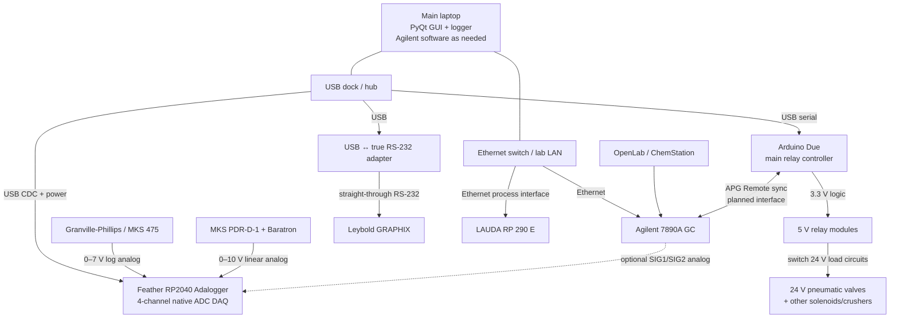
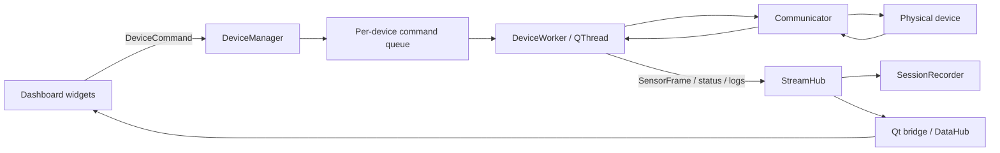
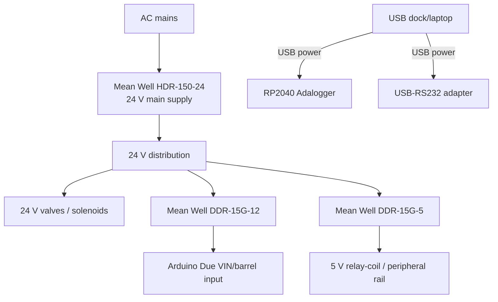

# System architecture

Updated: **2026-10-07**

This document distinguishes the physical laboratory system from what is currently wired into the desktop application.

## Whole-system control and acquisition diagram



### Integration status of the diagram

- **Integrated now:** Due/relay control and the generic threaded device/data architecture.
- **Reference code exists but not injected into main app:** GRAPHIX and Feather analog DAQ.
- **Planned/documented:** LAUDA Ethernet communicator, GC APG Remote interface, optional GC analog monitor.

## Desktop data/control path



This architecture is intentionally device-agnostic. New instruments should be added as communicators rather than teaching widgets how to speak RS-232, TCP, or ADC protocols.

## Power architecture

The intended control-power topology is a **single 24 V DC bus** with local DC/DC conversion. Standalone laboratory instruments retain their normal mains power.



The current BOM snapshot uses the **12 V DIN converter** for the Due; older notes that mention a 9 V Pololu converter are superseded by that choice.

## Analog DAQ channels

Baseline divider per 0–10 V channel:

```text
Instrument signal ---- 30.1 kΩ ----+---- Feather ADC (A0/A1/...)
                                   |
                                  10.0 kΩ
                                   |
Instrument return -----------------+---- Feather GND
                                   |
                                  100 nF
                                   |
                                  GND
```

Divider gain for reconstructing instrument voltage:

```text
Vin ≈ Vadc × (30.1k + 10.0k) / 10.0k = Vadc × 4.01
```

Current planned assignments:

| ADC | Source | Conversion |
|---|---|---|
| A0 | GP475 analog output | logarithmic pressure (`10^(V-4)` Torr in default 0–7 V/Torr mode) |
| A1 | PDR-D-1 `DC OUT` | linear pressure: `P = V/10 × full_scale` |
| A2 | spare / optional GC SIG1 | depends on GC configuration |
| A3 | spare / optional GC SIG2 | depends on GC configuration |

## Cable-routing intent

Physically separate these groups where possible:

```text
SIGNAL / LOW LEVEL             POWER / SWITCHED LOADS
------------------             ----------------------
GP475 analog                   24 V solenoid wiring
PDR-D-1 analog                 relay contact wiring
thermocouple                   valve-manifold wiring
USB/Ethernet                   high-current actuator wiring
```

Use through-bolted cable-tie bases / reusable strain relief at the edge-mounted USB dock, and leave service loops at connectors that users will plug/unplug.
